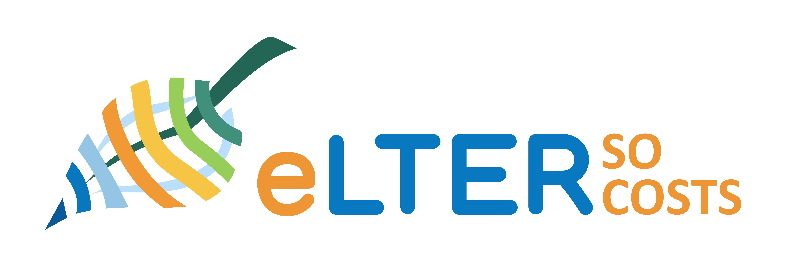

# eLTER SO Costs web application



## Authors :busts_in_silhouette:
- <b>Name:</b> Allan T. Souza
  - <b>Affiliation:</b> Institute for Atmospheric and Earth System Research (INAR), Forest Sciences, Faculty of Agriculture and Forestry, University of Helsinki, P.O. Box 27, 00014 Helsinki, Finland :finland:
  - <b> Institution ROR:</b> [https://ror.org/040af2s02](https://ror.org/040af2s02)
  - <b>E-mail:</b> allan.souza@helsinki.fi / allantsouza@gmail.com
  - <b>ORCID:</b> [0000-0002-1851-681X](https://orcid.org/0000-0002-1851-681X)

- <b>Name:</b> Syed Ashraful Alam
  - <b>Affiliation:</b> Institute for Atmospheric and Earth System Research (INAR), Forest Sciences, Faculty of Agriculture and Forestry, University of Helsinki, P.O. Box 27, 00014 Helsinki, Finland :finland:
  - <b> Institution ROR:</b> [https://ror.org/040af2s02](https://ror.org/040af2s02)
  - <b>E-mail:</b> ashraful.alam@helsinki.fi
  - <b>ORCID:</b> [0000-0001-9870-1494](https://orcid.org/0000-0001-9870-1494)

- <b>Name:</b> Terhi Rasilo
  - <b>Affiliation:</b> Institute for Atmospheric and Earth System Research (INAR), Forest Sciences, Faculty of Agriculture and Forestry, University of Helsinki, P.O. Box 27, 00014 Helsinki, Finland :finland:
  - <b> Institution ROR:</b> [https://ror.org/040af2s02](https://ror.org/040af2s02)
  - <b>E-mail:</b> terhi.rasilo@helsinki.fi
  - <b>ORCID:</b> [0000-0002-3502-4040](https://orcid.org/0000-0002-3502-4040)
  
- <b>Name:</b> Steffen Zacharias
  - <b>Affiliation:</b> Department for Monitoring and Exploration Technologies, UFZ—Helmholtz Centre for Environmental Research GmbH, Leipzig, Germany :de:
  - <b> Institution ROR:</b> [https://ror.org/000h6jb29](https://ror.org/000h6jb29)
  - <b>E-mail:</b> steffen.zacharias@ufz.de
  - <b>ORCID:</b> [0000-0002-7825-0072](https://orcid.org/0000-0002-7825-0072)

- <b>Name:</b> Jaana Bäck
  - <b>Affiliation:</b> Institute for Atmospheric and Earth System Research (INAR), Forest Sciences, Faculty of Agriculture and Forestry, University of Helsinki, P.O. Box 27, 00014 Helsinki, Finland :finland:
  - <b> Institution ROR:</b> [https://ror.org/040af2s02](https://ror.org/040af2s02)
  - <b>E-mail:</b> jaana.back@helsinki.fi
  - <b>ORCID:</b> [0000-0002-6107-667X](https://orcid.org/0000-0002-6107-667X)

## Use license :balance_scale:
- [CC0 1.0](https://creativecommons.org/publicdomain/zero/1.0/)

## Context and aims :book: :dart:

This repository hosts the information used to build the [eLTER](https://elter-ri.eu/) SO Costs web application. This tool is a specialized resource designed to assist the eLTER (European Long-Term Ecosystem Research) community in estimating the costs associated with upgrading and operating [standard observations](https://elter-ri.eu/storage/app/uploads/public/62c/ea2/a00/62cea2a002845239798196.pdf) across various eLTER sites.

The essence of this tool lies in its ability to adapt calculations based on unique site-specific criteria, ensuring tailored cost estimations. Key factors taken into consideration include the site category, the habitats, the focus spheres, and the potential co-location with other Research Infrastructures, which cover the costs of specific standard observations.

The goal of this tool is to provide a user-friendly, efficient, and reliable means for the eLTER community to plan and allocate resources effectively.

## Input data :floppy_disk:

The input data was built based on the agreement of the eLTER community regarding the standard observations. The data is located at the `data` folder and contains consensus information on the target sampling protocols, equipment, as well as estimations on the costs associated to upgrade and operate the standard observations. 

## Structure of files :open_file_folder:
```eLTER-SO-costs-App/
├── data # Folder for input data used by the app
│ ├── eLTER-SO-costs_list-of-standard-observations.xlsx # Data file in xlsx format
│ └── eLTER-SO-costs_standard-observations-detailed-costs_V18.csv # Data file in csv format
├── www # Folder containing web assets
│ ├── eLTER-SO-costs_landing-page-picture.jpg # Picture for the web application landing page
│ ├── eLTER-SO-costs_elter-logo.png # eLTER simplified logo in png format
│ └── eLTER-SO-costs_application-logo.jpg # SO Costs logo in jpg format
├── app.R # The main application script for the Shiny web app
├── .Rprofile # R project-specific configuration file
├── eLTER-SO-costs-App.Rproj # RStudio project file
├── .gitignore # Lists files to be ignored by version control system
├── LICENSE # The full text of the license for the project
├── README.html # Compiled HTML from README.md for detailed project information
├── README.md # Markdown text providing an overview of the project
├── renv # R environment setup with reproducibility in mind
│ └── ... # folders and files by renv to compile the needed information for reproducibility   
└── renv.lock # Lock file to capture the state of the R environment
```

## Development in R and `Shiny` :man_technologist:
The web application is coded entirely in the [R programming language](https://www.r-project.org/), with a user interface developed using R [`Shiny`](https://shiny.posit.co/). R `Shiny` is a powerful framework for building interactive web applications directly from R scripts, making it an ideal choice for creating accessible and user-friendly tools.

### Deployed version of the web application :globe_with_meridians:
You can access the current version of the `Shiny` app [here](https://allantsouza.shinyapps.io/eLTER-SO-costs/).

### Future hosting on eLTER service portal :motorway:
Upon completion and thorough testing, this tool will be hosted as part of the [eLTER service portal](https://portal.elter.cerit-sc.cz/en). This integration aims to provide seamless access and utility for the eLTER community. Until then, this repository serves as the primary hub for development, where updates, enhancements, and bug fixes will be continuously pushed.

## Reproducibility :gear:
This repository utilizes the [`renv`](https://rstudio.github.io/renv/) package to manage R dependencies, ensuring that everyone working on the project has access to the same package versions. By locking the project to specific versions of R packages, `renv` ensures that the project can be run consistently across different setups and over time.

### Getting started :beginner:
When you clone or fork this repository for the first time, follow these steps to set up `renv`:

- Install `renv` (if you haven't already)
  - You can install `renv` globally in your R setup using:

```
install.packages("renv")
```

- Clone the repository
  - Clone this repository to your local machine.
- Launch R
  - Open an R session and set the working directory to the root of the cloned repository.
- Restore the environment
  - Install all the necessary packages, as specified in the `renv.lock` file, into a project-local library by running the following command in your R console:

```
renv::restore()
```

- Start working
  - After the restoration process is complete, you can start working on the project. The `renv` environment will automatically be activated when you open the project in the future.

## Related resources :paperclips:
- [Zacharias, S. et al. (2021).](https://elter-ri.eu/storage/app/uploads/public/62c/ea2/a00/62cea2a002845239798196.pdf) Discussion paper on eLTER Standard Observations (eLTER SOs). Deliverable D3.1 EU Horizon 2020 eLTER PLUS Project, Grant agreement No. 871128. 

## [CRediT](https://onlinelibrary.wiley.com/doi/epdf/10.1002/leap.1210) author statement :man_scientist: :woman_scientist:

| Contributor         | Contributions                                                            |
|---------------------|--------------------------------------------------------------------------|
| Allan T. Souza      | Conceptualization, Data Curation, Formal analysis, Methodology, Software, Validation, Visualization, Writing - Original Draft. |
| Syed Ashraful Alam  | Conceptualization, Validation, Visualization, Writing - Review & Editing. |
| Terhi Rasilo        | Conceptualization, Project Administration, Validation, Writing - Review & Editing. |
| Steffen Zacharias   | Conceptualization, Data Curation, Investigation, Supervision, Validation, Writing - Review & Editing. |
| Jaana Bäck          | Conceptualization, Data Curation, Funding Acquisition, Investigation,  Project Administration, Resources, Supervision, Validation, Writing - Review & Editing. |

## Acknowledgements :bank: :eu:
This work has been supported by the European Union's H2020 (grant agreement No 871128 - eLTER PLUS). 

## Citation :memo:
Souza, AT., Alam, SA., Rasilo, T., Zacharias, S., Bäck, J. (2024). eLTER SO Costs web application.
